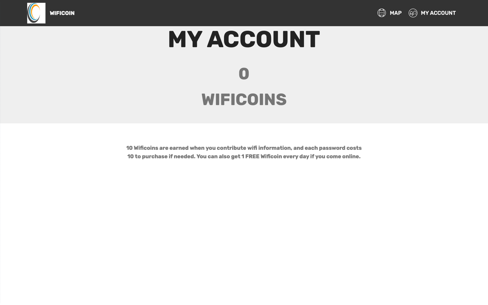

# Android App: WIFICOIN
```
Ranjan Behl, Haowei Shi, Neel Sangani, Viranch Bateriwala
```

## About:
```
WIFICOIN is a new way to share WIFI with those around you in an
urban setting. For example, if you’re travelling in an unfamiliar city
with no mobile internet connection, you can purchase WIFI Coins to
gain access to nearby WIFI networks. The application lists nearby
WIFI networks that can be accessed using WIFI Coins.
```
## Usage:
```
  App/WifiCoin is the actual project, import this folder in android studio
```
## Features:

I. Easily connect to local WIFI networks.

II. Earn WIFI Coins by sharing your network access.

III. Get a daily bonus for logging in.

IV. Account creation is not needed, uses device IMEI for login.

## Screenshots

## Figure 1 :WIFI Sharing Menu


## Figure 2 : Account Balance



## Figure 3 : MAP with Wifi Spots(Mobile)

## Permissions
```
On Android versions prior to Android 7.0, WIFICoin requires the following permissions:
- Full Network Access.
- View Network Connections.
- Run at startup.
- Read and access to IMEI.
```
## Technical Details:

```
OS: Android 7.0 or higher
Frontend: Android studios with Mobirise using JS
Backend: php with MySQL using phpMyAdmin
APIs: Google Maps, custom-made php API for server-side
integration
```

